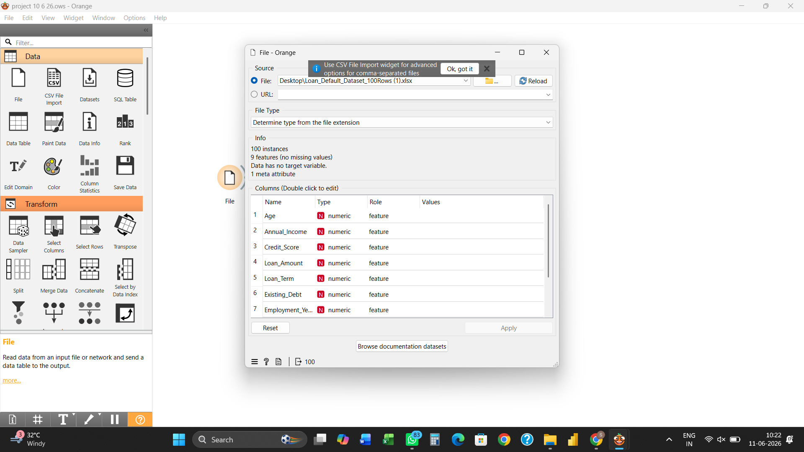
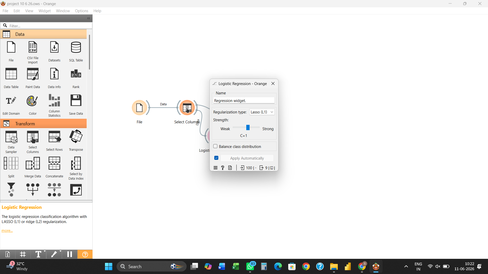

# 📊 Loan Default Prediction using Orange Data Mining

## Project Overview

This project demonstrates the use of **Orange Data Mining** to build a Loan Default Prediction model using Logistic Regression.

The objective is to identify borrowers who are likely to default on loans by analyzing financial and demographic attributes. The project follows a no-code machine learning approach using Orange's visual workflow interface.

---

## 🎯 Objectives

- Predict potential loan defaults
- Analyze borrower risk profiles
- Apply Logistic Regression for classification
- Evaluate model performance
- Support data-driven lending decisions

---

## 🛠 Tools & Technologies

- Orange Data Mining
- Logistic Regression
- Data Visualization
- Classification Modeling
- Test & Score Evaluation

---

## 📂 Workflow

### 1. Dataset Import

Load and preprocess the loan dataset.

---

### 2. Feature Selection

Select relevant variables for prediction.

---

### 3. Logistic Regression Model

Build and train the classification model.

---

### 4. Model Evaluation

Evaluate performance using Test & Score.

---

## 📈 Model Benefits

- Early identification of risky borrowers
- Improved credit decision-making
- Reduced loan default risk
- Better portfolio management
- Faster analysis through automation

---

## 🔍 Business Impact

This project demonstrates how machine learning can support financial institutions in improving risk assessment and making more accurate lending decisions.

---

## 📚 Skills Demonstrated

- Predictive Analytics
- Financial Risk Analysis
- Classification Techniques
- Data Preprocessing
- Model Evaluation
- Business Analytics

---

## 👨‍💼 Author

**Gagan Sharma**  
MBA Finance  
Financial Analytics | AI & Automation | Business Analytics
